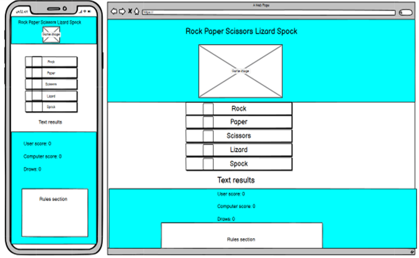
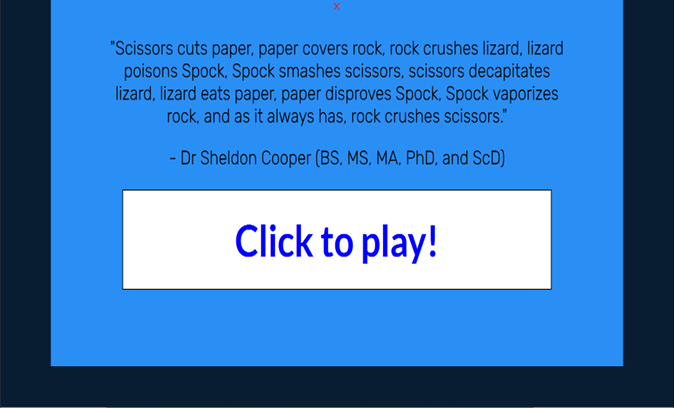
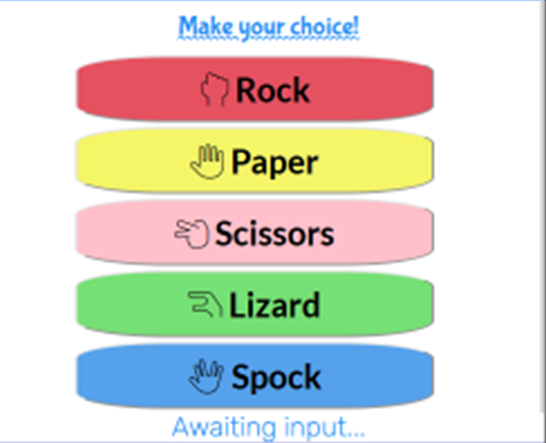
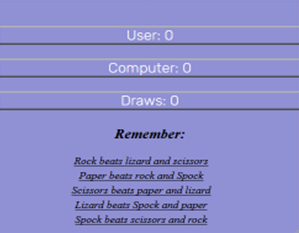
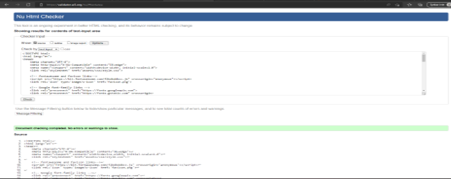
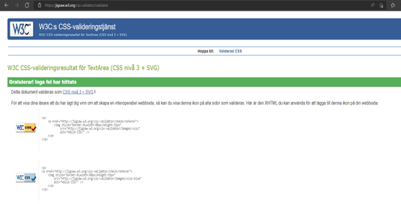
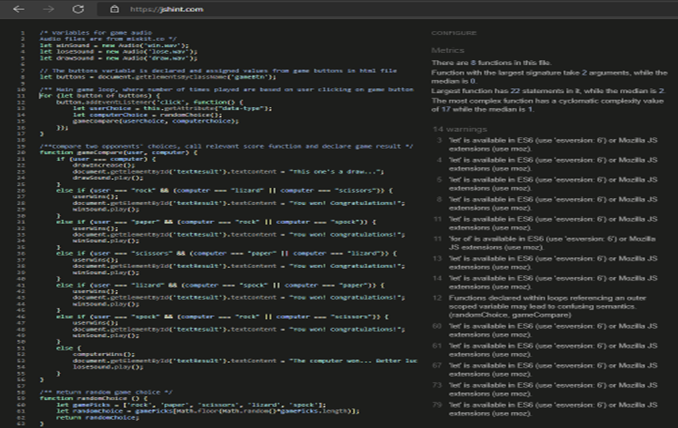

## Purpose
The site allows the user to play a game of 'Rock, Paper, Scissors, Lizard, Spock' (RPSLS for short) against the computer. A score system is provided for the user to see the number of user wins, computer wins, and matches that end in a draw. The game is an extension of the classic, familiar rock, paper, scissors game. Because of this, showcased hand signs and rules clarifying how the game works is also included on the website. 
## Structure
When the page is loaded, the user is presented with a window explaining the rules, using a quote from the show 'Big Bang Theory'. The user exits the modal window and arrives at the main page. The main page contains a header, a game section, a score section, and finally a rules section at the bottom. 

The wepbage's layout will change depending on the size of the screen used, making the site user-friendly and responsive whether it's run on a pc, laptop, tablet or a smartphone. 

## Wireframes
The original wireframes intended for this project. 

## Design
### Color scheme
For this website, lighter, medium-bright colors were used. The header, results and rule sections contains softer background colors, while the game buttons are more brightly colored against a white background. The bright coloring brings focus to the game section, which is the most important one. 

The modal window has black text against the same clear blue background as the header. A button transitioning between white and red background contrasts to the modal window. 
### Typography
The top header and game header uses the Bubblegum font. The game button and modal button uses the Lato font. The modal text and scoreboard uses the Rubik font.
### Icons
In the game buttons, icons are used to display the hand signs next to the correct game options. 

## Features
### Existing features
* Modal window appearing when page first loads  

* Rock, paper, scissors lizard, Spock game against computer, with game results written out on screen (replacing 'Awaiting input...' text)  

* Game audio after win, loss or draw
* Score system and rule section  

### Features left to implement
* Cross-platform play (player versus player)
* Save user results to database for later access
## Technologies
* HTML
** This project uses HTML as the main language used to complete the website structure.
* CSS
** This project uses custom CSS to style the website.
* Javascript
** This project uses javascript to create user interactivity and game functionality to the website. 
* Gitpod
** This IDE is used during the project.
* Github
** Github is the hosting site used to store the source code for the website, and Github Pages is used to deploy the live site.
* Google Fonts
** The fonts Bubblegum, Lato and Rubik fonts are used in the style of the website.
* Fontawesome
** Fontawesome icons is added to the game buttons. 
## Testing
### Test strategy
During the coding process, continuous testing was done by using the console.log function in javascript, and viewing the website from a temporary server by using the python3 -m http.server command. Modal and game functionality, as well as website layout and design was taken into account. Media queries were used to ensure responsive design for screens of different sizes. The code was run through validators of HTML, CSS and Javascript. Finally, the website was deployed to Github Pages and tested on the browsers Microsoft Edge and Firefox on pc, as well as Safari on smartphone. 
### Test results
* HTML validator  
The HTML code was run through the W3C validator. No issues were found.  

* CSS validator  
The CSS code was run through the W3C jigsaw validator. No issues were found.  

* Javascript validator  
The javascript code was run through the jshint validator. Three types of issues were found:  
  * 'let' is available in ES6 (use 'esversion: 6') or Mozilla JS extensions (use moz).
  * 'for of' is available in ES6 (use 'esversion: 6') or Mozilla JS extensions (use moz).
  * Functions declared within loops referencing an outer scoped variable may lead to confusing semantics. (randomChoice, gameCompare)  
  
  The issues with 'let' and 'for of' is related to the ES6 version, and several people appear to get error messages regarding the ES6 while testing javascript code. The code of the website works as intended, and this is not a significant issue. 
  
  The third issue points out that semantic issues could be caused due to the function being declared and run by the click event. I think the for loop is fine as is, since the click event and the accompanying function only appears within that specific for loop, and the game works as intended.  
  
* DIfferent browsers and consoles 
The website works well on the browsers tested, and on laptop and smartphone. The HTML elements adjust nicely to the different screen size. No elements overlap. 

## Deployment
This project was started by creating a workspace in Gitpod using a template provided by Code Institute. Coding was made in browser window using Gitpod. The repository consists of an index.html file, favicon, audio files and an assets folder. The assets folder contains css folder with style.css file, js folder with script.js file, and folders for images. Changes were saved, committed and deployed using git.add, git.commit -m, and git.push commands. 

The finished website was deployed to Github Pages. 
## Credits
* Modal window  
Some of the code to create a modal window comes from the w3schools.com website: 
  * https://www.w3schools.com/howto/howto_css_modals.asp 

* Game audio  
The audio used comes from the mixkit.co website: 
  * https://mixkit.co/free-sound-effects/win/
  * https://mixkit.co/free-sound-effects/lose/
  *  https://mixkit.co/free-sound-effects/player/ 

* Game image  
The image used in the header comes from the seekpng.com website:  
  * https://www.seekpng.com/ima/u2w7w7o0i1t4o0a9/ 

* Favicon
  * https://icon-library.com/icon/rock-paper-scissors-icon-6.html 
